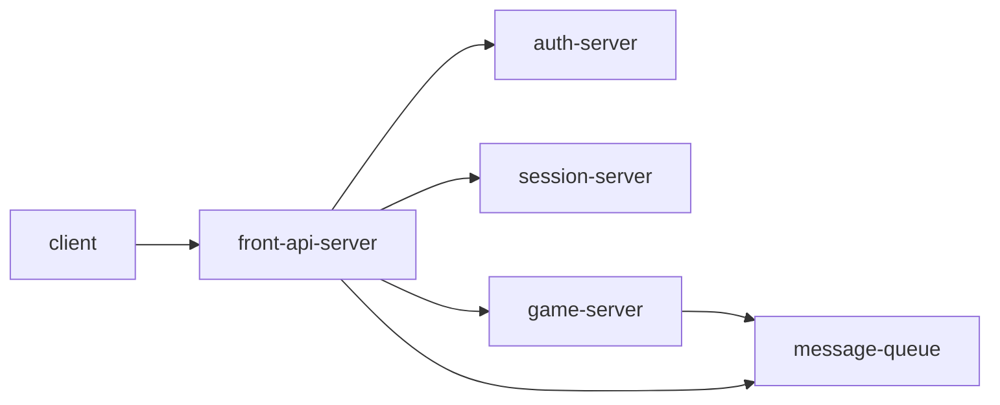

# 머드 게임 서버 MK1

## 구성



### front-api-server

client에서 받는 명령어 처리

### game-server

게임 관련 전반을 처리

### message-queue

클라이언트에 메세지 전송 스트리밍을 위해 사용

### session-server

client 세션 관리

### auth-server

우선 인증서버 사용해보다가, google 로그인 등으로 교체

## local 환경

```shell
$ docker-compose up
```

### 초기 설정

root 계정으로 mariadb 접속
```sql
CREATE SCHEMA mud;
GRANT ALL PRIVILEGES ON mud.* TO 'user'@'%';
```

### 로컬 테스트환경에서의 카프카 handling
* kafka 컨테이너 shell 접근 : docker -it local-kafka /bin/sh
* kafka bin 디렉터리 위치 : /opt/kafka_2.12-2.4.1/bin
* 명령어 사용법 : https://kafka.apache.org/quickstart
```
예제
// 메시지 consume
./bin/kafka-topics.sh –create –replication-factor 1 –partitions 1 –topic tmp_topic
./kafka-console-consumer.sh --topic channel.chat.1 --from-beginning --bootstrap-server localhost:9092
./kafka-console-producer.sh --topic channel.chat.1 --broker-list localhost:9092

docker run -p 9090:8080 \
	-e KAFKA_CLUSTERS_0_NAME=local \
	-e KAFKA_CLUSTERS_0_BOOTSTRAPSERVERS=kafka:9092 \
	-d provectuslabs/kafka-ui:latest
```

## 배포 방법

