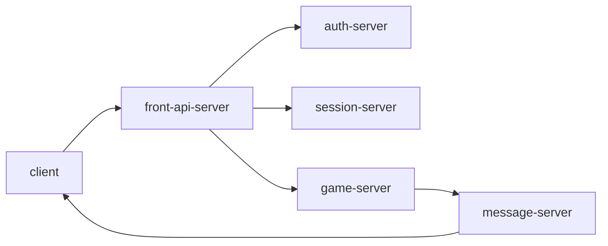

# 머드 게임 서버 MK1

## 구성

### front-api-server

client에서 받는 명령어 처리

### game-server

게임 관련 전반을 처리

### message-server

client에 메세지 push

### session-server

client 세션 관리

### auth-server

우선 인증서버 사용해보다가, google 로그인 등으로 교체

## local 빌드 방법

## 배포 방법

