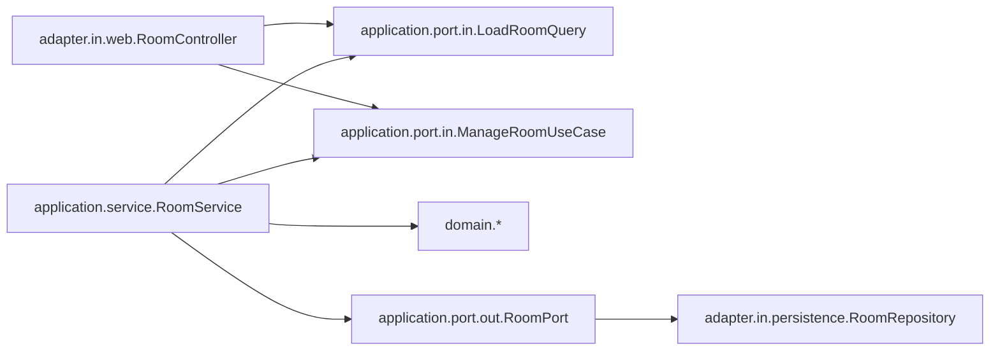
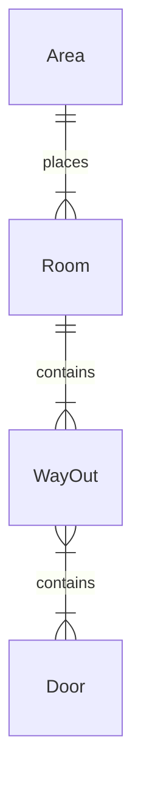

## 게임서버

### map 패키지 의존관계

```mermaid
graph LR;
  adapter.in.web.RoomController --> application.port.in.LoadRoomQuery;
  adapter.in.web.RoomController --> application.port.in.ManageRoomUseCase;
  application.service.RoomService --> application.port.in.LoadRoomQuery;
  application.service.RoomService --> application.port.in.ManageRoomUseCase;
  application.service.RoomService --> domain.*;
  application.service.RoomService --> application.port.out.RoomPort;
  application.port.out.RoomPort --> adapter.in.persistence.RoomRepository;
```

### map 연관 관계

연결 관계는 아래와 같다.  
> 방 - 출구 - 문 - 출구 - 방  

```mermaid
erDiagram
    Area ||--|{ Room : places
    Room ||--|{ WayOut : contains
    WayOut }|--|{ Door : contains
```