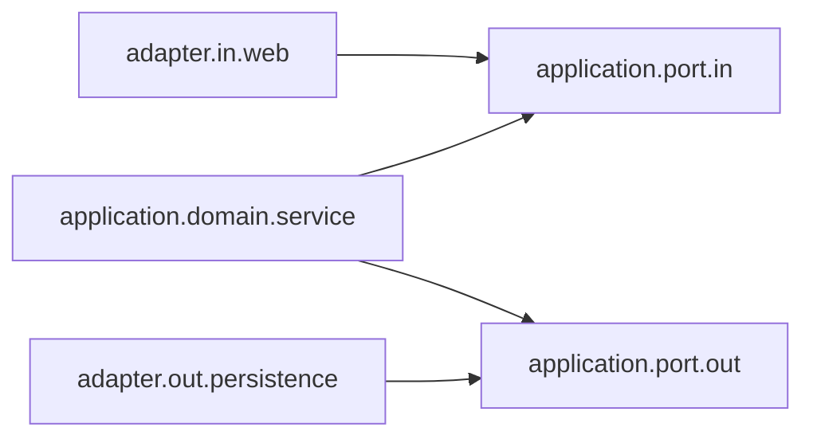
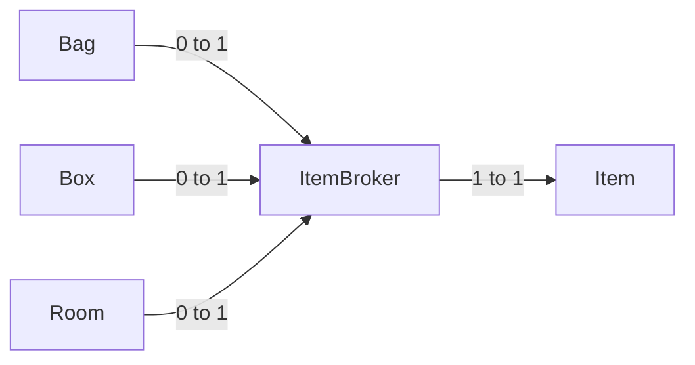

## 게임서버

### 패키지 의존관계

1. `adapter.in.web`: 외부 인터페이스 레이어로, 웹 요청과 같은 외부 요청을 처리하며, application.port.in에 의존합니다.
2. `application.port.in`: 응용 프로그램의 내부 로직에 대한 인바운드 포트로, 외부 레이어인 adapter.in.web과 내부 도메인 서비스인 application.domain.service 사이의 인터페이스 역할을 합니다.
3. `application.domain.service`: 도메인 로직을 수행하는 서비스 레이어로, application.port.in과 application.port.out에 의존합니다. 이를 통해 내부 로직을 처리하고, 외부 데이터 소스와의 통신을 관리합니다.
4. `application.port.out`: 응용 프로그램의 외부 리소스에 대한 아웃바운드 포트로, 외부 데이터 저장소나 서비스와의 인터페이스 역할을 합니다. 이 포트는 adapter.out.persistence에 의존합니다.
5. `adapter.out.persistence`: 외부 인터페이스 레이어로, 데이터베이스와 같은 영속성 메커니즘을 처리하며, application.port.out에 의존합니다.

### map 연관 관계

연결 관계는 아래와 같다.  
> 방 - 출구 - 문 - 출구 - 방  

### Item Entity 설계

인스턴스로 생성된 아이템의 소유자는 하나여야 한다.  
이를 강제하기 위해 아이템을 소유하기 위해서는 Item Entity에 직접 접근하지 않고,  
ItemBroker를 통해 접근을 한다.

ItemBroker는 소유자와 1대 1 참조관계를 갖는다.

